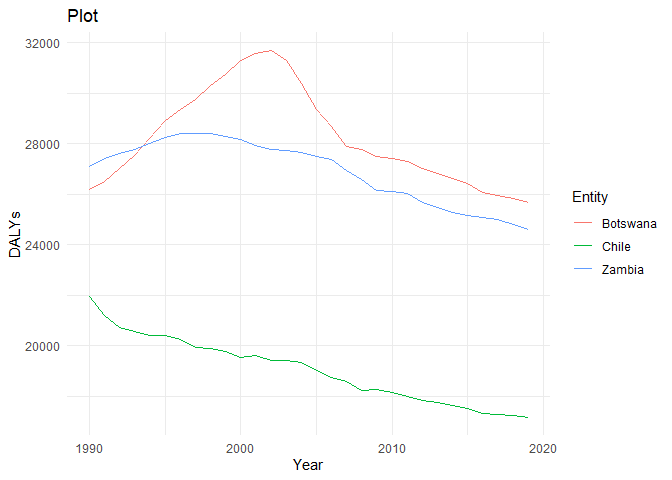

Global Disease Burden Analysis
================
Seydou TOGUIYENI 2

# Introduction

This document compares the Disability-Adjusted Life Year (DALY) diseases
burden for three countries: Botswana, Chile, and Zambia. We compare the
burden due to communicable, maternal, neonatal, and nutritional diseases
(CMNN), non-communicable diseases (NCDs), and overall disease burden for
these countries.

The source data is from the Institute for Health Metrics and Evaluation
(IHME) Global Burden of Disease (GBD) study.

# Communicable, Maternal, Neonatal, and Nutritional Disease Burden (CMNN)

    ## Rows: 8100 Columns: 4
    ## ── Column specification ────────────────────────────────────────────────────────
    ## Delimiter: ","
    ## chr (2): Entity, Code
    ## dbl (2): Year, DALYs (Disability-Adjusted Life Years) - Communicable, matern...
    ## 
    ## ℹ Use `spec()` to retrieve the full column specification for this data.
    ## ℹ Specify the column types or set `show_col_types = FALSE` to quiet this message.

## Table of Estimates for CMNN Burden Over Time

## Plot Showing Trends in CMNN Burden Over Time

## Summary of CMNN Burden Findings

Provide a brief analysis based on the data presented in the table and
chart. Highlight any significant findings or patterns. About 3
sentences.

# Non-Communicable Disease Burden (NCD)

    ## Rows: 8010 Columns: 4
    ## ── Column specification ────────────────────────────────────────────────────────
    ## Delimiter: ","
    ## chr (2): Entity, Code
    ## dbl (2): Year, DALYs (Disability-Adjusted Life Years) - Non-communicable dis...
    ## 
    ## ℹ Use `spec()` to retrieve the full column specification for this data.
    ## ℹ Specify the column types or set `show_col_types = FALSE` to quiet this message.

## Table of Estimates for NCD Burden Over Time

| Year | Botswana | Chile | Zambia |
|-----:|---------:|------:|-------:|
| 1990 |    26191 | 21933 |  27086 |
| 1991 |    26509 | 21218 |  27421 |
| 1992 |    27015 | 20734 |  27621 |
| 1993 |    27528 | 20549 |  27755 |
| 1994 |    28218 | 20400 |  27986 |
| 1995 |    28895 | 20394 |  28244 |
| 1996 |    29361 | 20265 |  28385 |
| 1997 |    29737 | 19942 |  28397 |
| 1998 |    30315 | 19876 |  28386 |
| 1999 |    30743 | 19769 |  28279 |
| 2000 |    31282 | 19528 |  28175 |
| 2001 |    31559 | 19608 |  27928 |
| 2002 |    31665 | 19416 |  27779 |
| 2003 |    31269 | 19436 |  27717 |
| 2004 |    30380 | 19345 |  27662 |
| 2005 |    29329 | 19033 |  27478 |
| 2006 |    28672 | 18756 |  27374 |
| 2007 |    27904 | 18579 |  26938 |
| 2008 |    27747 | 18241 |  26572 |
| 2009 |    27480 | 18272 |  26160 |
| 2010 |    27403 | 18165 |  26106 |
| 2011 |    27282 | 17980 |  26019 |
| 2012 |    27012 | 17845 |  25688 |
| 2013 |    26801 | 17755 |  25477 |
| 2014 |    26617 | 17623 |  25271 |
| 2015 |    26407 | 17520 |  25141 |
| 2016 |    26064 | 17313 |  25064 |
| 2017 |    25948 | 17278 |  24993 |
| 2018 |    25836 | 17226 |  24785 |
| 2019 |    25672 | 17179 |  24596 |

Table of Estimates for NCD Burden Over Time

## Plot Showing Trends in NCD Burden Over Time

<!-- -->

## Summary of NCD Burden Findings

Provide a brief analysis based on the data presented in the table and
chart. Highlight any significant findings or patterns. About 3
sentences.

# Overall Disease Burden

    ## Rows: 8100 Columns: 4
    ## ── Column specification ────────────────────────────────────────────────────────
    ## Delimiter: ","
    ## chr (2): Entity, Code
    ## dbl (2): Year, DALYs (Disability-Adjusted Life Years) - All causes - Sex: Bo...
    ## 
    ## ℹ Use `spec()` to retrieve the full column specification for this data.
    ## ℹ Specify the column types or set `show_col_types = FALSE` to quiet this message.

## Table of Estimates for Overall Disease Burden Over Time

## Plot Showing Trends in Overall Disease Burden Over Time

## Summary of Overall Disease Burden Findings

Provide a brief analysis based on the data presented in the table and
chart. Highlight any significant findings or patterns. About 3
sentences.
