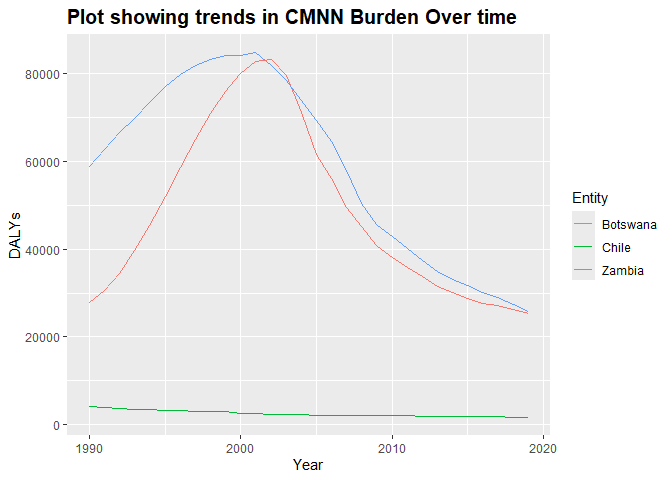

Global Disease Burden Analysis
================
Seydou TOGUIYENI

# Introduction

This document compares the Disability-Adjusted Life Year (DALY) diseases
burden for three countries: Botswana, Chile, and Zambia. We compare the
burden due to communicable, maternal, neonatal, and nutritional diseases
(CMNN), non-communicable diseases (NCDs), and overall disease burden for
these countries.

The source data is from the Institute for Health Metrics and Evaluation
(IHME) Global Burden of Disease (GBD) study.

# Communicable, Maternal, Neonatal, and Nutritional Disease Burden (CMNN)

    ## Rows: 8100 Columns: 4
    ## ── Column specification ────────────────────────────────────────────────────────
    ## Delimiter: ","
    ## chr (2): Entity, Code
    ## dbl (2): Year, DALYs (Disability-Adjusted Life Years) - Communicable, matern...
    ## 
    ## ℹ Use `spec()` to retrieve the full column specification for this data.
    ## ℹ Specify the column types or set `show_col_types = FALSE` to quiet this message.

## Table of Estimates for CMNN Burden Over Time

| Year | Botswana | Chile | Zambia |
|-----:|---------:|------:|-------:|
| 1990 |    27884 |  4139 |  58757 |
| 1991 |    30569 |  3806 |  62679 |
| 1992 |    34417 |  3664 |  66572 |
| 1993 |    39628 |  3524 |  69735 |
| 1994 |    45513 |  3394 |  73466 |
| 1995 |    51963 |  3336 |  77051 |
| 1996 |    58672 |  3263 |  79825 |
| 1997 |    65051 |  3094 |  81799 |
| 1998 |    70892 |  3032 |  83235 |
| 1999 |    75963 |  2914 |  84186 |
| 2000 |    80139 |  2647 |  84062 |
| 2001 |    82856 |  2528 |  84768 |
| 2002 |    83153 |  2309 |  81769 |
| 2003 |    79539 |  2242 |  78563 |
| 2004 |    71218 |  2247 |  73901 |
| 2005 |    61477 |  2160 |  69419 |
| 2006 |    56015 |  2106 |  64637 |
| 2007 |    49421 |  2084 |  57853 |
| 2008 |    45214 |  2024 |  50416 |
| 2009 |    40857 |  2055 |  45610 |
| 2010 |    38023 |  1999 |  42950 |
| 2011 |    35883 |  1993 |  40191 |
| 2012 |    33664 |  1953 |  37372 |
| 2013 |    31593 |  1911 |  34920 |
| 2014 |    30037 |  1915 |  33171 |
| 2015 |    28866 |  1844 |  31649 |
| 2016 |    27704 |  1795 |  30144 |
| 2017 |    27097 |  1748 |  28970 |
| 2018 |    26344 |  1718 |  27432 |
| 2019 |    25444 |  1689 |  25908 |

Table of Estimates for CMNN Burden Over Time

## Plot Showing Trends in CMNN Burden Over Time

<!-- -->

## Summary of CMNN Burden Findings

Provide a brief analysis based on the data presented in the table and
chart. Highlight any significant findings or patterns. About 3
sentences.

# Non-Communicable Disease Burden (NCD)

    ## Rows: 8010 Columns: 4
    ## ── Column specification ────────────────────────────────────────────────────────
    ## Delimiter: ","
    ## chr (2): Entity, Code
    ## dbl (2): Year, DALYs (Disability-Adjusted Life Years) - Non-communicable dis...
    ## 
    ## ℹ Use `spec()` to retrieve the full column specification for this data.
    ## ℹ Specify the column types or set `show_col_types = FALSE` to quiet this message.

## Table of Estimates for NCD Burden Over Time

## Plot Showing Trends in NCD Burden Over Time

## Summary of NCD Burden Findings

Provide a brief analysis based on the data presented in the table and
chart. Highlight any significant findings or patterns. About 3
sentences.

# Overall Disease Burden

    ## Rows: 8100 Columns: 4
    ## ── Column specification ────────────────────────────────────────────────────────
    ## Delimiter: ","
    ## chr (2): Entity, Code
    ## dbl (2): Year, DALYs (Disability-Adjusted Life Years) - All causes - Sex: Bo...
    ## 
    ## ℹ Use `spec()` to retrieve the full column specification for this data.
    ## ℹ Specify the column types or set `show_col_types = FALSE` to quiet this message.

## Table of Estimates for Overall Disease Burden Over Time

## Plot Showing Trends in Overall Disease Burden Over Time

## Summary of Overall Disease Burden Findings

Provide a brief analysis based on the data presented in the table and
chart. Highlight any significant findings or patterns. About 3
sentences.
